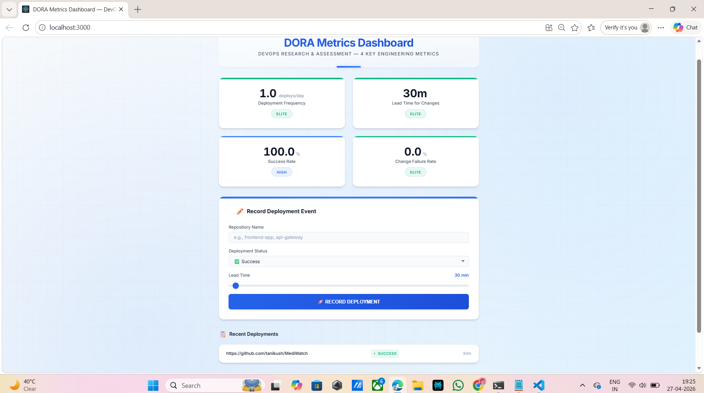
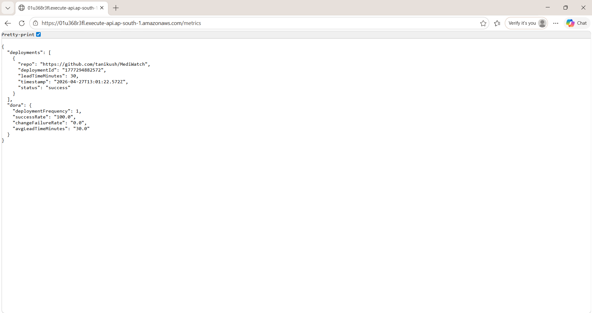
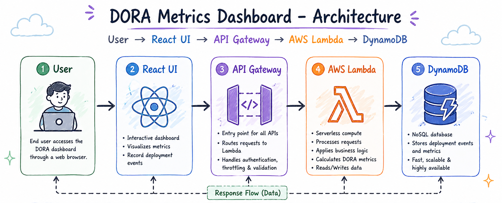
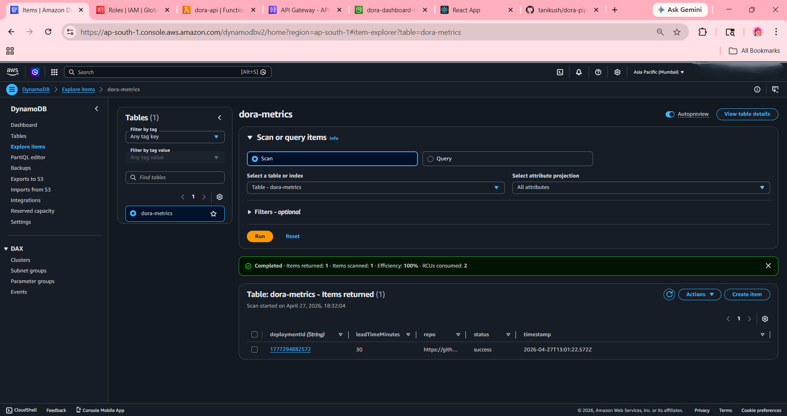
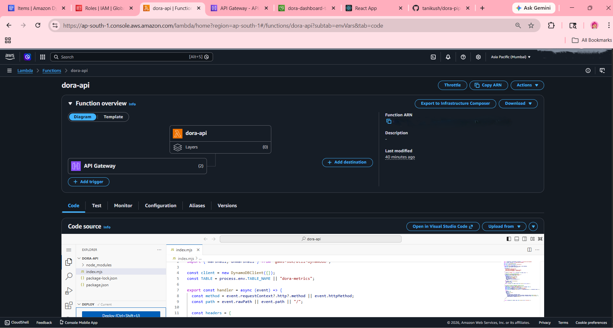

# 🚀 DORA Metrics Dashboard

[](https://reactjs.org/)
[](LICENSE)
[](CONTRIBUTING.md)

A modern, **production-ready DORA Metrics Dashboard** built with React 19 that visualizes DevOps Research & Assessment metrics in real-time. Track Deployment Frequency, Lead Time, Change Failure Rate, and Success Rate with an elegant, responsive UI connected to AWS backend services.

---

## 📸 Application Screenshots

### 🎯 Dashboard Overview

*Main dashboard displaying real-time DORA metrics with color-coded performance badges (Elite/High/Medium)*

### 📝 Record Deployment

*Interactive form to capture deployment events — repo name, success/failure status, and lead time slider*

### 📋 Recent Deployments

*Live deployment history showing last 5 events with status indicators and timing*

---

## 🏗️ Infrastructure & Deployment

### 🔵 AWS DynamoDB

*DynamoDB table storing deployment metrics and historical data with timestamp indexing*

### ⚡ AWS Lambda Function

*Serverless Lambda function handling metric calculations and data persistence*

### 🔄 GitHub Actions CI/CD

*Automated deployment pipeline — builds React app and deploys to AWS S3 & Lambda*

### 📦 AWS S3 Deployment

*Static hosting on S3 with CloudFront CDN for global availability*

---

## ✨ Key Features

✅ **Real-Time Metrics** — Live data fetching from AWS API Gateway every 60 seconds  
✅ **DORA Compliant** — Automatically classifies performance (Elite/High/Medium)  
✅ **Deployment Tracking** — Log new releases with repo, status, and lead time  
✅ **Audit History** — View last 5 deployments with color-coded success/failure  
✅ **Responsive Design** — Mobile-first CSS with graceful degradation  
✅ **Zero External UI Libs** — Custom design system, no MUI/AntD dependencies  
✅ **Type-Safe** — Numeric conversion guards against API type inconsistencies  
✅ **Auto-Refresh** — Metrics update automatically without page reload  

---

## 🛠️ Technology Stack

| Layer | Technology | Purpose |
|-------|-----------|---------|
| **Frontend** | React 19.2.5 | Component UI with hooks (useState, useEffect) |
| | ReactDOM 19.2.5 | Client-side rendering |
| | Create React App 5.0.1 | Build tooling & dev server |
| | Web Vitals 2.1.4 | Performance monitoring |
| **Backend** | AWS Lambda | Serverless API endpoints |
| | AWS API Gateway | RESTful metrics API |
| | AWS DynamoDB | NoSQL metrics storage |
| **CI/CD** | GitHub Actions | Automated build & deployment |
| | AWS S3 | Static website hosting |
| | AWS CloudFront | CDN & SSL termination |
| **Design** | CSS Custom Properties | Design tokens (colors, spacing, shadows) |
| | Inter Font | Modern UI typography |
| | CSS Grid/Flexbox | Responsive layouts |

---

## 📊 DORA Metrics Reference

| Metric | Elite | High | Medium |
|--------|-------|------|--------|
| **Deployment Frequency** | ≥ 1/day | ≥ 0.5/day | < 0.5/day |
| **Lead Time for Changes** | ≤ 60 min | ≤ 24 hours | > 24 hours |
| **Change Failure Rate** | < 5% | < 15% | ≥ 15% |
| **Time to Restore Service** | < 1 hour | < 24 hours | ≥ 24 hours |

*Benchmarks sourced from [Google's Accelerate State of DevOps Report](https://services.google.com/fh/files/misc/accelerate-state-of-devops-2021.pdf)*

---

## 🚦 Getting Started

### Prerequisites

- Node.js ≥ 16.x (recommended: 18.x or 20.x)
- npm ≥ 7.x
- Git
- Modern browser (Chrome, Firefox, Safari, Edge)

### Local Development

```bash
# Clone repository
git clone https://github.com/tanikush/dora-ui.git
cd dora-ui

# Install dependencies
npm install

# Start development server
npm start
```

App opens at **http://localhost:3000** with hot reload enabled.

---

## ⚙️ Configuration

### API Endpoint

The frontend connects to AWS API Gateway. Default endpoint:

```javascript
// src/App.js line 3
const API = "https://01u368r3fl.execute-api.ap-south-1.amazonaws.com";
```

**To customize:** Create `.env.local` file:

```env
REACT_APP_API_URL=https://your-api-endpoint.com
```

Then update `App.js`:

```javascript
const API = process.env.REACT_APP_API_URL;
```

### Environment Files

| File | Purpose |
|------|---------|
| `.env.local` | Local overrides (gitignored) |
| `.env.development` | Development environment |
| `.env.production` | Production environment |

---

## 🔌 API Reference

### GET `/metrics`

Fetches current DORA metrics and recent deployments.

**Response:**
```json
{
  "dora": {
    "deploymentFrequency": 1.2,
    "avgLeadTimeMinutes": 45,
    "successRate": 95.5,
    "changeFailureRate": 3.2
  },
  "deployments": [
    {
      "deploymentId": "uuid-v4",
      "repo": "frontend-app",
      "status": "success",
      "leadTimeMinutes": 30,
      "timestamp": "2026-04-27T12:00:00Z"
    }
  ]
}
```

### POST `/metrics`

Records a new deployment event.

**Request Body:**
```json
{
  "repo": "backend-api",
  "status": "success",
  "leadTimeMinutes": 45
}
```

---

## 📁 Project Structure

```
dora-ui/
├── src/
│   ├── App.js              # Main dashboard component (80 lines)
│   ├── App.css             # Legacy styles (unused)
│   ├── index.js            # React entry point
│   ├── index.css           # Global CSS + design system
│   ├── App.test.js         # Unit tests (Jest + RTL)
│   ├── reportWebVitals.js  # Performance monitoring
│   └── setupTests.js       # Test config
├── public/
│   ├── index.html          # HTML template with meta tags
│   ├── manifest.json       # PWA configuration
│   ├── favicon.ico         # Favicon
│   └── logo*.png           # PWA icons
├── screenshots/            # Project screenshots (git-tracked)
│   ├── dashboard.png
│   ├── metics.png
│   ├── DORA.png
│   ├── Dynamodb.png
│   ├── lambda.png
│   ├── github action.png
│   └── s3 project dashboard.png
├── docs/
│   └── screenshots/        # Screenshot capture guide
│       └── README.md
├── lambda/                 # Backend Lambda code (separate repo)
│   └── index.mjs
├── .github/
│   └── workflows/
│       └── deploy.yml      # CI/CD pipeline
├── build/                  # Production build (gitignored)
├── node_modules/           # Dependencies (gitignored)
├── package.json            # Dependencies & scripts
├── package-lock.json       # Locked dependency tree
├── README.md               # This file
├── CONTRIBUTING.md         # Contribution guidelines
├── LICENSE                 # MIT License
└── .gitignore              # Git ignore rules
```

---

## 🧪 Testing

```bash
# Run tests in watch mode
npm test

# Run tests once (CI mode)
CI=true npm test

# Test with coverage
npm test -- --coverage
```

---

## 🏗️ Build & Deploy

### Production Build

```bash
# Create optimized production bundle
npm run build

# Output: /build directory (ready for deployment)
# - Static assets (JS, CSS, images)
# - Index.html with hashed filenames
# - Gzipped compression ready
```

### Deploy to AWS (Automatic)

Push to `main` branch triggers GitHub Actions:

1. **Lambda Deployment** — Updates function code from `lambda/` folder
2. **React Build** — Runs `npm install && npm run build`
3. **S3 Sync** — Uploads `build/` folder to S3 bucket
4. **CloudFront Invalidation** — (if configured) clears CDN cache

**Manual deployment:**

```bash
# Build locally
npm run build

# Upload to S3
aws s3 sync build/ s3://your-bucket-name --delete

# Invalidate CloudFront (optional)
aws cloudfront create-invalidation --distribution-id XYZ --paths "/*"
```

---

## 🎨 Customization

### Change Color Palette

Edit CSS variables in `src/index.css`:

```css
:root {
  --color-primary: #2563eb;      /* Brand blue */
  --status-elite: #10b981;       /* Success green */
  --status-high: #3b82f6;        /* Info blue */
  --status-medium: #f59e0b;      /* Warning orange */
  --status-low: #ef4444;         /* Error red */
}
```

### Adjust DORA Thresholds

Modify `getStatus()` function in `src/App.js:37-42`:

```javascript
const getStatus = (value, metric) => {
  if (metric === "freq") return value >= 1 ? "ELITE" : value >= 0.5 ? "HIGH" : "MEDIUM";
  if (metric === "cfr") return value < 5 ? "ELITE" : value < 15 ? "HIGH" : "MEDIUM";
  if (metric === "lead") return value <= 60 ? "ELITE" : value <= 1440 ? "HIGH" : "MEDIUM";
  return "HIGH";
};
```

---

## 🤝 Contributing

We welcome contributions! Please read [CONTRIBUTING.md](CONTRIBUTING.md) for detailed guidelines.

### Quick Start

```bash
# Fork the repo
# Clone your fork
git clone https://github.com/YOUR-USERNAME/dora-ui.git

# Create feature branch
git checkout -b feature/amazing-feature

# Commit changes (follow Conventional Commits)
git commit -m "feat(metrics): add lead time threshold slider"

# Push and open PR
git push origin feature/amazing-feature"
```

---

## 📄 License

Distributed under the **MIT License**. See [LICENSE](LICENSE) for details.

---

## 🙋 Support

- **Issues & Bugs**: [GitHub Issues](https://github.com/tanikush/dora-ui/issues)
- **Discussions**: [GitHub Discussions](https://github.com/tanikush/dora-ui/discussions)
- **Email**: tanikush@gmail.com

---

## 🙏 Acknowledgments

- **DORA Metrics** — Google's DevOps Research & Assessment team
- **Create React App** — Facebook's React build tooling
- **AWS Lambda & API Gateway** — Serverless backend infrastructure
- **GitHub Actions** — Continuous integration & deployment

---

## 📚 Learn More

- [DORA Metrics Guide](https://cloud.google.com/devops/learn/dora-metrics)
- [Accelerate Book](https://itrevolution.com/book/accelerate/)
- [React Documentation](https://react.dev/)
- [AWS Serverless](https://aws.amazon.com/serverless/)

---

**⭐ If this project helps you, please give it a star!**

*Last updated: April 2026 | Built with ❤️ using React & AWS*
